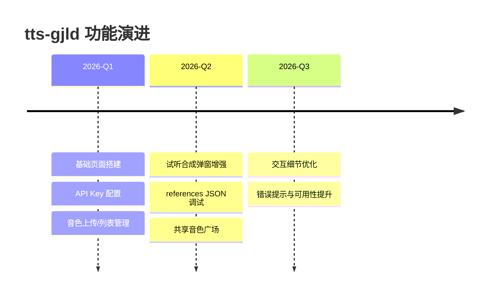

# ✨ tts-gjld · 二次元音色工坊

<p align="center">
  
  
  
  
</p>

<p align="center">
  
  
  
  
</p>

> 对接 SiliconFlow 音频接口的 Vue3 工具站。
> 支持 **音色上传 / 音色管理 / 一键试听合成 / 共享音色广场**，走一个酷炫、直给、能打的 TTS 工作流。

---

## 🌌 项目亮点

- 🎤 自定义音色上传：本地音频 + 参考文本，一键生成可复用 URI
- 🎛 音色管理面板：刷新、复制、试听、删除，全流程可视化
- 🧪 试听合成弹窗：支持 `voice` / `references` 双模式调试
- 🏪 共享音色广场：内置音色素材，上传后可直接进入试听
- 💰 余额查看：快速确认当前 API 可用额度
- 🖼 随机背景切换：轻量二次元氛围感 UI

---

## 🧩 技术栈小卡片

| 分类 | 技术 |
|---|---|
| 前端框架 |  |
| 构建工具 |  |
| 语言 |  |
| API |  |
| 运行环境 |  |

---

## 📈 趋势图（A+B 组合）

### 1) GitHub 关注趋势（真实数据）

[](https://www.star-history.com/?repos=runmyway%2tts-gjld&type=date&legend=top-left)

### 2) 功能演进趋势（项目路线）



---

## 🚀 快速开始

### 1. 安装依赖

```bash
npm install
```

### 2. 本地开发

```bash
npm run dev
```

### 3. 构建发布

```bash
npm run build
npm run preview
```

---

## ⚙️ 使用流程

1. 打开页面后先填写并保存 SiliconFlow API Key（`sk-` 开头）
2. 上传本地参考音频，填写音色名与参考文本
3. 在音色管理表中复制 URI 或直接点「试听」
4. 在试听弹窗中输入文本，设置格式/采样率/速度/增益并合成
5. 也可进入共享音色广场，一键上传并带入试听

---

## 🔌 关键接口（SiliconFlow）

- `POST /uploads/audio/voice`：上传音色
- `GET /audio/voice/list`：获取音色列表
- `POST /audio/speech`：语音合成
- `POST /audio/voice/deletions`：删除音色
- `GET /user/info`：余额查询

参考文档：`https://docs.siliconflow.cn/cn/api-reference/audio`

---

## 📁 项目结构

```text
tts-gjld/
├─ src/
│  ├─ App.vue
│  ├─ main.js
│  └─ components/
│     └─ SpeechDebugPanel.vue
├─ public/
├─ package.json
└─ README.md
```

---

## 🗺 Roadmap

- [ ] 增加更多预置音色模板与标签筛选
- [ ] 增加试听历史记录与一键复用
- [ ] 增加移动端交互细节适配
- [ ] 增加批量管理能力（批量复制/删除）

---

## 🌟 Star 支持

如果这个项目对你有帮助，欢迎点个 Star：

👉 https://github.com/irunmyway/tts-gjld
